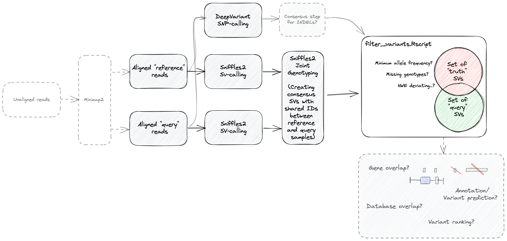

# Introduction

There are pipelines available for analysis of long-read data such as [nf-core/nanoseq](https://nf-co.re/nanoseq), for detection of variants in WGS/WES data there's [nf-core/sarek](https://nf-co.re/nanoseq) and [nf-core/raredisease](https://nf-co.re/raredisease) which is under development. However, is there any pipeline incorporating SV and SNP-calls to find rare diseases in long-read data, using a set of known variants derived from high-quality long-read data? Otherwise: 

## Overview

