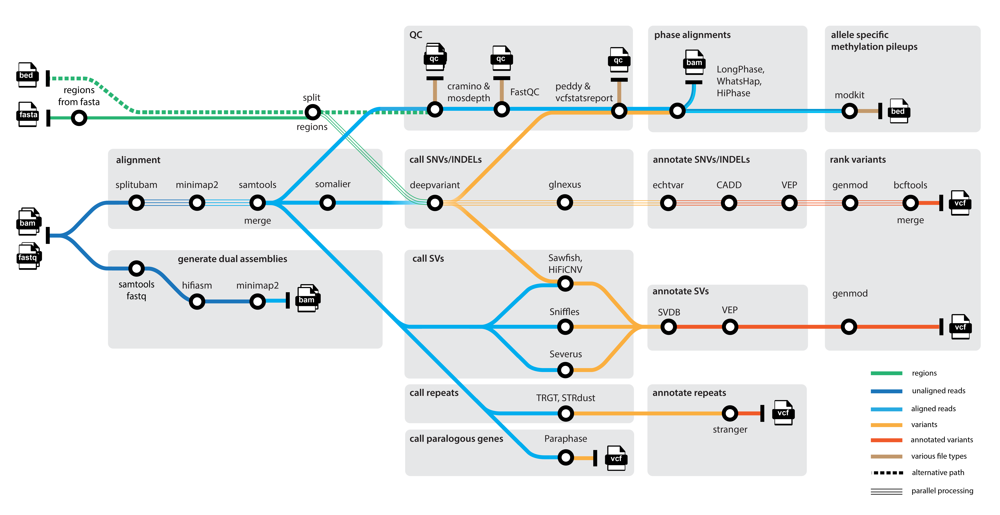

## Introduction

**genomic-medicine-sweden/nallo** is a bioinformatics analysis pipeline for long-reads from both PacBio and (targeted) ONT-data, focused on rare-disease. Heavily influenced by best-practice pipelines such as [nf-core/sarek](https://nf-co.re/sarek), [nf-core/raredisease](https://nf-co.re/raredisease), [nf-core/nanoseq](https://github.com/nf-core/nanoseq), [PacBio Human WGS Workflow](https://github.com/PacificBiosciences/pb-human-wgs-workflow-snakemake), [epi2me-labs/wf-human-variation](https://github.com/epi2me-labs/wf-human-variation) and [brentp/rare-disease-wf](https://github.com/brentp/rare-disease-wf).

<picture align="center">
    
  </picture>

## Pipeline summary

### QC

- Read QC with [FastQC](http://www.bioinformatics.babraham.ac.uk/projects/fastqc/), [cramino](https://github.com/wdecoster/cramino) and [mosdepth](https://github.com/brentp/mosdepth)

### Alignment & assembly

- Assemble genomes with [hifiasm](https://github.com/chhylp123/hifiasm)
- Align reads and assemblies to reference with [minimap2](https://github.com/lh3/minimap2)

### Variant calling

- Call SNVs & joint genotyping with [deepvariant](https://github.com/google/deepvariant) and [GLNexus](https://github.com/dnanexus-rnd/GLnexus)
- Call SVs with [Severus](https://github.com/KolmogorovLab/Severus) or [Sniffles](https://github.com/fritzsedlazeck/Sniffles)
- Call CNVs with [HiFiCNV](https://github.com/PacificBiosciences/HiFiCNV)
- Call tandem repeats with [TRGT](https://github.com/PacificBiosciences/trgt/tree/main) (HiFi only)
- Call paralogous genes with [Paraphase](https://github.com/PacificBiosciences/paraphase)

### Phasing and methylation

- Phase and haplotag reads with [LongPhase](https://github.com/twolinin/longphase), [whatshap](https://github.com/whatshap/whatshap) or [HiPhase](https://github.com/PacificBiosciences/HiPhase)
- Create methylation pileups with [modkit](https://github.com/nanoporetech/modkit)

### Annotation

- Annotate SNVs and INDELs with databases of choice, e.g. [gnomAD](https://gnomad.broadinstitute.org), [ClinVar](https://www.ncbi.nlm.nih.gov/clinvar/), [CADD](https://cadd.gs.washington.edu) with [echtvar](https://github.com/brentp/echtvar) and [VEP](https://github.com/Ensembl/ensembl-vep)
- Annotate repeat expansions with [stranger](https://github.com/Clinical-Genomics/stranger)
- Annotate SVs with [SVDB](https://github.com/J35P312/SVDB) and [VEP](https://github.com/Ensembl/ensembl-vep)

### Ranking

- Rank SNVs, INDELs, SVs and CNVs with [GENMOD](https://github.com/Clinical-Genomics/genmod)

### Filtering

- Filter SNVs, INDELs, SVs and CNVs with [filter_vep](https://www.ensembl.org/vep) and [bcftools](https://samtools.github.io/bcftools/bcftools.html)

## Usage

!!! note

    If you are new to Nextflow and nf-core, please refer to [this page](https://nf-co.re/docs/usage/installation) on how to set-up Nextflow. Make sure to [test your setup](https://nf-co.re/docs/usage/introduction#how-to-run-a-pipeline) with `-profile test` before running the workflow on actual data.

Prepare a samplesheet with input data:

`samplesheet.csv`

```
project,sample,file,family_id,paternal_id,maternal_id,sex,phenotype
NIST,HG002,/path/to/HG002.fastq.gz,FAM1,HG003,HG004,1,2
NIST,HG005,/path/to/HG005.bam,FAM1,HG003,HG004,2,1
```

Supply a reference genome with `--fasta` and choose a matching `--preset` for your data (`revio`, `pacbio`, `ONT_R10`). Now, you can run the pipeline using:

```bash
nextflow run genomic-medicine-sweden/nallo \
    -profile <docker/singularity/.../institute> \
    --input samplesheet.csv \
    --preset <revio/pacbio/ONT_R10> \
    --fasta <reference.fasta> \
    --outdir <OUTDIR>
```

!!!warning

    Please provide pipeline parameters via the CLI or Nextflow `-params-file` option. Custom config files including those provided by the `-c` Nextflow option can be used to provide any configuration _**except for parameters**_;see [docs](https://nf-co.re/usage/configuration#custom-configuration-files).

To run in an offline environment, download the pipeline and singularity images using [`nf-core download`](https://nf-co.re/tools/#downloading-pipelines-for-offline-use):

```
nf-core download genomic-medicine-sweden/nallo
```

For more details and further functionality, please refer to the [usage documentation](usage.md).

## Credits

genomic-medicine-sweden/nallo was originally written by [Felix Lenner](https://github.com/fellen31).

We thank the following people for their extensive assistance in the development of this pipeline: [Anders Jemt](https://github.com/jemten), [Annick Renevey](https://github.com/rannick), [Daniel Schmitz](https://github.com/Schmytzi), [Lucía Peña-Pérez](https://github.com/Lucpen), [Peter Pruisscher](https://github.com/peterpru) & [Ramprasad Neethiraj](https://github.com/ramprasadn).

## Contributions and Support

If you would like to contribute to this pipeline, please see the [contributing guidelines](https://github.com/genomic-medicine-sweden/nallo/blob/dev/.github/CONTRIBUTING.md).

## Citations

If you use genomic-medicine-sweden/nallo for your analysis, please cite it using the following doi: [10.5281/zenodo.13748210](https://doi.org/10.5281/zenodo.13748210).

This pipeline uses code and infrastructure developed and maintained by the [nf-core](https://nf-co.re) community, reused here under the [MIT license](https://github.com/nf-core/tools/blob/main/LICENSE).

> **The nf-core framework for community-curated bioinformatics pipelines.**
>
> Philip Ewels, Alexander Peltzer, Sven Fillinger, Harshil Patel, Johannes Alneberg, Andreas Wilm, Maxime Ulysse Garcia, Paolo Di Tommaso & Sven Nahnsen.
>
> _Nat Biotechnol._ 2020 Feb 13. doi: [10.1038/s41587-020-0439-x](https://dx.doi.org/10.1038/s41587-020-0439-x).

An extensive list of references for the tools used by the pipeline can be found in the [`CITATIONS.md`](CITATIONS.md) file.
